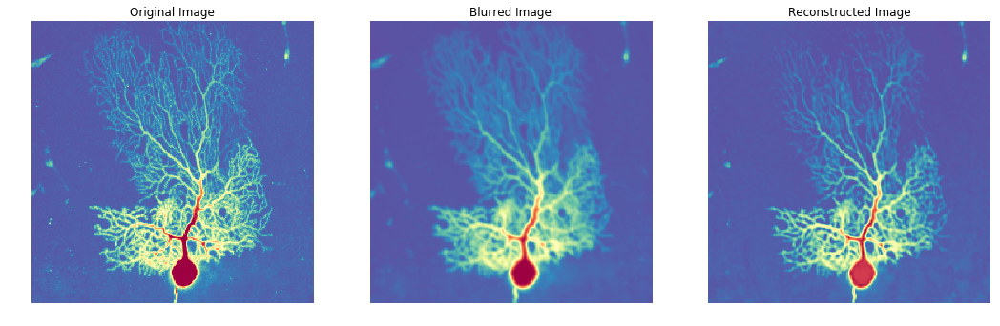

# Flowdec

**Flowdec** is a library containing [TensorFlow](https://github.com/tensorflow/tensorflow) (TF) implementations of image and signal deconvolution algorithms.  Currently, only [Richardson-Lucy Deconvolution](https://en.wikipedia.org/wiki/Richardson%E2%80%93Lucy_deconvolution) has been implemented but others may come in the future.

Flowdec is designed to construct and execute TF graphs in python as well as use frozen, exported graphs from other languages (e.g. Java).

Here are a few of the major advantages and disadvantages of Flowdec at the moment:

*Advantages*

- **Support for Windows, Mac, and Linux** - Because TensorFlow can run on these platforms, so can Flowdec
- **Client Support for Java, Go, C++, and Python** - Using Flowdec graphs from Python and Java has been tested, but theoretically they could also be used by any [TensorFlow API Client Libraries](https://www.tensorflow.org/api_docs/)
- **GPU Accleration** - Executing [TensorFlow graphs on GPUs](https://www.tensorflow.org/programmers_guide/using_gpu) is trivial and will happen by default w/ Flowdec if you meet all of the TensorFlow requirements for this (i.e. CUDA Toolkit installed, Nvidia drivers, etc.)
- **Performance** - There are some other similar open source solutions that run *partially* with GPU acceleration, though this generally means that only FFT and iFFT operations run on GPUs while all other operations run on the CPU -- Experiments with Flowdec show that this means that the same 3D image may take ~8 mins to run on a single CPU, ~40s to run with another open source solution using only FFT/iFFT GPU accleration, and ~1s with Flowdec/TensorFlow using GPU accleration for all operations.
- **Signal Dimensions** - Flowdec can support 1, 2, or 3 dimensional images/signals
- **Multi-GPU Usage** - This has yet to be tested, but theoretically this is possible since TF can do it (and this [Multi-GPU Example](java/flowdec/src/main/java/org/hammerlab/tfdecon/examples/MultiGPUExample.java) is a start)
- **Image Preprocessing** - A trickier part of deconvolution implementations is dealing with image padding and cropping necessary to use faster FFT implementations -- in Flowdec, image padding using the reflection of the image along each axis can be specified manually or by letting it automatically round up and pad to the nearest power of 2 (which will enable use of faster Cooley-Tukey algorithm instead of the Bluestein algorithm provided by Nvidia cuFFT used by TF).
- **Visualizing Iterations** - Another difficulty with iterative deconvolution algorithms is in determining when they should stop.  With Richardson Lucy, this is usually done somewhat subjectively based on visualizing results for different iteration counts and Flowdec at least helps with this by letting ```observer``` functions be given that take intermediate results of the deconvolution process to be written out to image sequences or stacks for manual inspection.  Future work may include using [Tensorboard](https://www.tensorflow.org/programmers_guide/summaries_and_tensorboard) to do this instead but for now, it has been difficult to get image summaries working within TF "while" loops.

*Disadvantages*

- **Point Spread Functions** - Flowdec does not yet generate point spread functions so these must be built and supplied by something such as [PSFGenerator](http://bigwww.epfl.ch/algorithms/psfgenerator/).
- **No Blind Deconvolution** - Currently, nothing in this arena has been attempted but since much recent research on this subject is centered around solutions in deep learning, TensorFlow will hopefully make for a good platform in the future.

## Basic Usage

Here is a basic example demonstrating how Flowdec can be used in a single 3D image deconvolution:

See full example notebook [here](python/examples/Neuron%20-%203D%20Deconvolution.ipynb)

```python
%matplotlib inline
import numpy as np
import matplotlib.pyplot as plt
from skimage import exposure
from scipy import ndimage, signal
from flowdec import data as fd_data
from flowdec import psf as fd_psf
from flowdec import restoration as fd_restoration

# Load "Purkinje Neuron" dataset downsampled from 200x1024x1024 to 50x256x256
# See: http://www.cellimagelibrary.org/images/CCDB_2
actual = fd_data.neuron_25pct().data
# actual.shape = (50, 256, 256)

# Create a gaussian kernel that will be used to blur the original acquisition
kernel = np.zeros_like(actual)
for offset in [0, 1]:
    kernel[tuple((np.array(kernel.shape) - offset) // 2)] = 1
kernel = gaussian_filter(kernel, sigma=1.)
# kernel.shape = (50, 256, 256)

# Convolve the original image with our fake PSF
data = signal.fftconvolve(actual, kernel, mode='same')
# data.shape = (50, 256, 256)

# Run the deconvolution process and note that deconvolution initialization is best kept separate from 
# execution since the "initialize" operation corresponds to creating a TensorFlow graph, which is a 
# relatively expensive operation and should not be repeated across multiple executions
algo = fd_restoration.RichardsonLucyDeconvolver(data.ndim).initialize()
res = algo.run(fd_data.Acquisition(data=data, kernel=kernel), niter=30).data

fig, axs = plt.subplots(1, 3)
axs = axs.ravel()
fig.set_size_inches(18, 12)
center = tuple([slice(None), slice(10, -10), slice(10, -10)])
titles = ['Original Image', 'Blurred Image', 'Reconstructed Image']
for i, d in enumerate([actual, data, res]):
    img = exposure.adjust_gamma(d[center].max(axis=0), gamma=.2)
    axs[i].imshow(img, cmap='Spectral_r')
    axs[i].set_title(titles[i])
    axs[i].axis('off')
```




## More Examples

### Python 

- [C. Elegans](python/examples/CElegans%20-%20Multiple%20Channel%20Example.ipynb) - Deconvolution of 712x672x104 acquisition for 3 separate channels
- [Astronaut](python/examples/Astronaut%20-%20Ringing%20Artifacts.ipynb) - Dealing with artifacts in deconvolved images
- [Hollow Bars](python/examples/Hollow%20Bars%20-%20Synthetic%20Deconvolution.ipynb) - Deconvolution of 256x256x128 (rows x cols x z) synthetic data
- [Hollow Bars GPU Benchmarking](python/examples/Hollow%20Bars%20-%20Benchmarking.ipynb) - Testing running times on full Hollow Bars volume with GPU present
- [Graph Export](python/examples/Algorithm%20Graph%20Export.ipynb) - Defining and exporting TensorFlow graphs

### Java

- [Multi-GPU Example](java/flowdec/src/main/java/org/hammerlab/tfdecon/examples/MultiGPUExample.java) - Prototype example for how to (hopefully) be able to execute deconvolution against multiple GPUs in parallel

## Installation

The project can be installed, ideally in a python 3.6 environment (though it should work in 3.5 too), by running:

```bash
git clone https://github.com/hammerlab/flowdec.git
cd flowdec
pip install .
```


### Docker Instructions

A local docker image can be built by running:

```bash
cd flowdec  # Note: not flowdec/docker, just cd flowdec

docker build --no-cache -t flowdec -f docker/Dockerfile .

# If on a system that supports nvidia-docker, the GPU-enabled version can be built instead via:
# nvidia-docker build --no-cache -t flowdec -f docker/Dockerfile.gpu .
```

The image can then be run using:

```bash
# Run in foreground (port mapping is host:container if 8888 is already taken)
docker run -ti -p 8888:8888 flowdec

# Run in background
docker run -td -p 8888:8888 --name flowdec flowdec
docker exec -it flowdec /bin/bash # Connect 
```

The Flowdec dockerfile extends the [TensorFlow DockerHub Images](https://hub.docker.com/r/tensorflow/tensorflow/) so its usage is similar where running it in the foreground automatically starts jupyter notebook and prints a link to connect to it via a browser on the host system.

## References

- [1] D. Sage, L. Donati, F. Soulez, D. Fortun, G. Schmit, A. Seitz, R. Guiet, C. Vonesch, M. Unser<br>
    DeconvolutionLab2: An Open-Source Software for Deconvolution Microscopy<br>
    Methods - Image Processing for Biologists, 115, 2017.<br>
- [2] J. Li, F. Xue and T. Blu<br>
    Fast and accurate three-dimensional point spread function computation for fluorescence microscopy<br>
    J. Opt. Soc. Am. A, vol. 34, no. 6, pp. 1029-1034, 2017.<br>
- [3] Brandner, D. and Withers, G.<br>
    The Cell Image Library, CIL: 10106, 10107, and 10108.<br>
    Available at http://www.cellimagelibrary.org. Accessed December 08, 2010.<br>

## TODO

- Cleanup python scripting examples
- Figure out how to specify orientation of z-stacks for PSF generator (and which direction test datasets have)
    - Research coverslip thickness and working distance inputs
- Add and test java within docker image: ```apt-get install -y default-jdk maven```
- Test multi-gpu on some linux machine via java
- Tensorboard monitoring during iterations instead of python function injection
